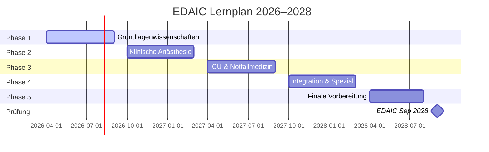

---
tags:
  - EDAIC
  - dashboard
  - index
erstellt: 2026-03-21
prüfung: 2028-09
status: aktiv
---

# 🎓 EDAIC – Lernplan & Prüfungsvorbereitung

> [!info] Prüfungsziel
> **European Diploma in Anaesthesiology and Intensive Care (EDAIC)**
> Organisiert von der **ESAIC** (European Society of Anaesthesiology and Intensive Care)
> 🗓️ **Prüfungstermin:** September 2028 | **Beginn:** April 2026 | **Vorbereitung:** ~30 Monate

---

## 🗺️ Schnellnavigation

| Bereich | Link | Beschreibung |
|---|---|---|
| 📚 Curriculum | [[Curriculum Übersicht]] | Vollständiger Syllabus |
| 🗓️ Lernplan | [[Lernplan Übersicht]] | Monat-für-Monat-Plan |
| ✅ Fortschritt | [[Selbstbewertung & Fortschritt]] | Themen-Tracking |
| ❓ MCQ Paper A | [[MCQ – Paper A Physiologie & Pharmakologie]] | Grundlagen-MCQ |
| ❓ MCQ Paper B | [[MCQ – Paper B Klinisch & ICU]] | Klinische MCQ |
| 🎤 SOE Training | [[SOE Übersicht & Szenarien]] | Mündliche Prüfung |
| 📖 Ressourcen | [[Empfohlene Ressourcen]] | Bücher & Links |

---

## 📖 Theorie-Zusammenfassungen (Facharzt-Niveau)

| Thema | Theorie | MCQ-Test |
|---|---|---|
| ❤️ Kardiovaskuläre Physiologie | [[Physiologie – Kardiovaskulär]] | [[MCQ – Kardiovaskuläre Physiologie\|MTF-Übungen]] |
| 🫁 Respiratorische Physiologie | [[Physiologie – Respiratorisch]] | [[MCQ – Respiratorische Physiologie]] |
| 🫘 Renale Physiologie & Säure-Basen | [[Physiologie – Renale & Säure-Basen]] | [[MCQ – Renale Physiologie & Säure-Basen]] |
| 🧠 Neurophysiologie & Endokrinologie | [[Neurophysiologie & Endokrinologie]] | [[MCQ – Neurophysiologie & Endokrinologie]] |
| 💊 Pharmakologie Grundlagen & IV-Anästhetika | [[Pharmakologie – Grundlagen & IV-Anästhetika]] | [[MCQ – Pharmakologie & IV-Anästhetika]] |
| 🌬️ Inhalationsanästhetika & Opioide | [[Pharmakologie – Inhalationsanästhetika & Opioide]] | [[MCQ – Inhalationsanästhetika & Opioide]] |
| 💉 Muskelrelaxanzien & Lokalanästhetika | [[Pharmakologie – Muskelrelaxanzien & Lokalanästhetika]] | [[MCQ – Muskelrelaxanzien & Lokalanästhetika]] |
| 🩸 Physiologie der Blutgerinnung | [[Physiologie – Blutgerinnung]] | [[MCQ – Physiologie der Blutgerinnung]] |

---

## 📋 Prüfungsstruktur

### Part I – Schriftliche Prüfung (jährlich im September)

> [!example] Paper A – Grundlagenwissenschaften (60 MCQ, 120 Min)
> - Anatomie · Physiologie · Pharmakologie · Physik & Messung · Statistik
> - Format: **True/False** – 5 Aussagen pro Stamm, je W oder F
> - Keine Negativpunkte!

> [!example] Paper B – Klinische Anästhesie & ICU (60 MCQ, 120 Min)
> - Allgemein- & Regionalanästhesie · ICU · Notfallmedizin · Spezialgebiete
> - Format: **True/False** – 5 Aussagen pro Stamm, je W oder F

### Part II – Mündliche Prüfung (4 × 25 Min SOE)

> [!note] SOE-Stationen
> | Station | Thema | Dauer |
> |---|---|---|
> | SOE 1 | Physiologie & Anatomie (angewandt) | 25 Min |
> | SOE 2 | Pharmakologie & Klinische Messung (angewandt) | 25 Min |
> | SOE 3 | Klinische Anästhesie & Kritische Zwischenfälle | 25 Min |
> | SOE 4 | Intensivmedizin & Notfallmedizin | 25 Min |

> [!success] Bestehensgrenze Part II
> ≥ 25/40 Punkte Vormittag (SOE 1+2) **UND** ≥ 25/40 Punkte Nachmittag (SOE 3+4) **UND** ≥ 60/80 Gesamtpunkte

---

## 🗓️ Lernphasen-Übersicht

| Phase | Zeitraum | Schwerpunkt |
|---|---|---|
| [[Phase 1 – Grundlagenwissenschaften\|Phase 1]] | Apr–Sep 2026 | Anatomie, Physiologie, Pharmakologie, Physik |
| [[Phase 2 – Klinische Anästhesie\|Phase 2]] | Okt 2026–Mär 2027 | Allgemein- & Regionalanästhesie, perioperativ |
| [[Phase 3 – ICU und Notfallmedizin\|Phase 3]] | Apr–Sep 2027 | Intensivmedizin, Notfall, Reanimation |
| [[Phase 4 – Integration und Spezialgebiete\|Phase 4]] | Okt 2027–Mär 2028 | Pädiatrie, Geburtshilfe, Neuro, Schmerzmedizin |
| [[Phase 5 – Finale Vorbereitung\|Phase 5]] | Apr–Aug 2028 | Probeexamen, MCQ-Training, SOE-Mock |
| 🎯 **EDAIC** | **Sep 2028** | **Part I + Part II** |

---

## 📊 Aktueller Fortschritt (wöchentlich aktualisieren)

> [!tip] Woche vom: _______________

**Aktuelle Phase:** _______________
**Aktuelles Thema:** _______________
**Letzte Selbstbewertung:** _______________

### Diese Woche erledigt:
- [ ] Lerneinheit 1: _______________
- [ ] Lerneinheit 2: _______________
- [ ] MCQ-Test: ___/20 Fragen korrekt
- [ ] SOE-Übung: _______________

---

## 💡 Tipps & Erinnerungen

> [!tip] Online Assessment (OLA)
> Das ESAIC bietet jährlich im **April** ein Online Assessment (OLA) an – ideal als Standortbestimmung!
> 📅 **Geplant:** April 2027 und April 2028

> [!warning] Anmeldung nicht vergessen!
> EDAIC Part I Anmeldung: Frühzeitig auf **esaic.org** prüfen (Anmeldefrist beachten!)
> Voraussetzung: Nachweis von Weiterbildung in Anästhesiologie

> [!quote] Motto
> *"Success is the sum of small efforts, repeated day in and day out."*
